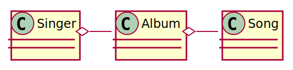

# msa-starter-example

## 설계



## 실행

```bash
# MySQL, Kafka 실행
~/msa-starter-example $ ./gradlew up

# JhipsterUaa 실행
~/jhipster-uaa $ ./gradlew clean bootRun

# Application 실행
~/msa-starter-example $ ./gradlew clean bootRun
```

## 포스트맨 컬렉션 & 환경

[postman](postman/)

---

## 개발 환경

- amazonaws corretto jdk 17을 사용합니다
```shell
$ brew install homebrew/cask-versions/corretto17 --cask
$ jenv add /Library/Java/JavaVirtualMachines/amazon-corretto-17.jdk/Contents/Home
$ jenv versions
```

- 아래 명령으로 MySQL(3306), Kafka(9092), jhipster-uaa(9999) 등을 구동합니다
```shell
~/example $ ./gradlew composeUp
# To stop and delete the cluster, ./gradlew composeDown
```

- 애플리케이션을 구동합니다
```shell
~/example $ export SPRING_PROFILES_ACTIVE=local; export USER_TIMEZONE="Asia/Seoul"; ./gradlew clean bootRun -x :clients:bootRun
$ curl -s http://localhost:8080/management/health
```
- [Postman Collection & Environment](./postman)를 import하여 Example 및 UAA API를 작동해볼 수 있습니다

### 계정

docker service|username|password
---|---|---
mysql|root|secret

## 개발

- java code는 [google style guide](https://github.com/google/styleguide/blob/gh-pages/intellij-java-google-style.xml)를 따릅니다 (hard wrap은 120까지 허용)
- 패키지 구조는 [육각형 구조](https://reflectoring.io/spring-hexagonal/)를 따릅니다

### 프로젝트 최신화

```shell
~/example $ ./gradlew dependencyUpdates
```

## 클라이언트 SDK 빌드 및 배포

```shell
~/example $ ./gradlew redoc
# 빌드된 API 문서는 build/redoc.html 입니다
```

